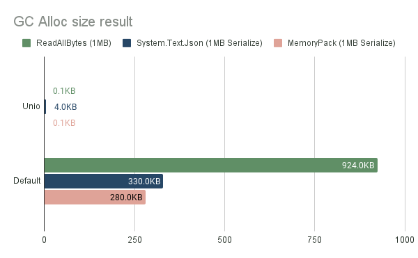

# Unio

[](./LICENSE)


Unio (short for unity native I/O) is a small utility set of I/O using native memory areas.

It provides a drop-in replacement of the `System.IO.File`.

| Feature                         | Description                                                  | 
|---------------------------------|--------------------------------------------------------------|
| `NativeFile.ReadAllBytes`       | The `NativeArray<byte>` version of `File.ReadAllBytes`.      | 
| `NativeFile.ReadAllBytesAsync`  | The `NativeArray<byte>` version of `File.ReadAllBytesAsync`. | 
| `NativeFile.WriteAllBytes`      | The `NativeArray<byte>` version of `File.WriteAllBytes`.     | 
| `NativeFile.WriteAllBytesAsync` | The `NativeArray<byte>` version of `File.WriteAllBytesAsync` | 

In addition, Unio provides NativeArray extensions for interoperability with modern memory-consuming C# APIs.

| Feature                      | Description                                            | 
|:-----------------------------|--------------------------------------------------------|
| `NativeArray<T>.AsMemory()`  | Convert `NativeArray<T>` to `System.Buffers.Memory<T>` |
| `NativeArrayBufferWriter<T>` | `NativeArray<byte>` version of `ArrayBufferWriter<T>`. |

Motivation:

Overloading the Managed GC area in C# leads to a performance penalty for the game.
- The GC Collect phase stops all managed threads.
- The managed memory area is expanded, the application's maximum memory usage tends to increase.

Therefore, it is an important optimization to use the native allocator for memory that does not need to be handled by C#.

Unity has the ability to allocate native area memory directly, instead of using C#'s GC managed heap. 
https://docs.unity3d.com/Manual/JobSystemNativeContainer.html 
Usually it can load Assets such as Mesh, Texture, and Addressable into its native memory area, but Unio can be used to extend this use.

It is effective if data to be read/written dynamically can also be treated as Native Memory area.
One typical example is Serialization.
Modern serializers (such as [System.Text.Json](https://learn.microsoft.com/dotnet/api/system.text.json), [MessagePack-CSharp](https://github.com/Cysharp/MessagePack-CSharp), [MemoryPack](https://github.com/Cysharp/MemoryPack), [VYaml](https://github.com/hadashiA/VYaml), etc) can take `ReadOnlySequence<byte>` or `IBufferWriter<byte>` as input. Unio is designed to integrate with these.
We want to treat the deserialization result as C# memory, but the raw data before deserialization is not needed on the C# side.



## Table of Contents

- [Installation](#installation)
- [Usage](#usage)
  - [Read file](#read-file)
  - [Write file](#write-file)
  - [NativeArrayBufferWriter](#native-array-buffer-writer) 
  - [Unity Assets Integration](#unity-assets-integrations)
- [LICENSE](#license)

## Installation

You can use add git URL from Package Manager:

```
https://github.com/hadashiA/Unio.git?path=/Assets/Unio#0.0.1
```

## Usage

### Read file

`NativeFile.ReadAllBytes` / `.ReadAllBytesAsync` is used to read the file contents at once into Unity's Native memory area.

```csharp
// Read file
// The return value is a NativeArray<byte>. Dispose when you have finished using it.
using var bytes = NativeFile.ReadAllBytes("/path/to/file");

// Read file with async
// The return value is a Awaitable<NativeArray<byte>>
using var bytes = await NativeFile.ReadAllBytesAsync("/path/to/file", cancellationToken: cancellationToken);
```

This is just an internal, [AsyncReadManager](https://docs.unity3d.com/ScriptReference/Unity.IO.LowLevel.Unsafe.AsyncReadManager.html). So it works on any platform.

By default, `ReadAllBytesAsync` performs a synchronous wait on the ThreadPool to optimize for latency.
If you want to change this behavior, you may supply a `SynchonizationStrategy` argument.

```csharp
using var bytes = await NativeFile.ReadAllBytesAsync("/path/to/file", SynchonizationStrategy.PlayerLoop);
```

- `SynchonizationStrategy.BlockOnThreadPool` (default)
  - Synchronous I/O on thread pools. Lowest latency.
- `SynchonizationStrategy.PlayerLoop`
   - Check for completion every frame by Unity's PlayerLoop.
   - It is suitable for environments where you want to wait on the main thread or where ThreadPool is not available, such as WebGL.


> [!NOTE]
> If you are using Unity older than 2023.1, the async method will use `Task<T>`, not `Awaitalbe<T>`.

In addition, a Unio extensions of `NativeArray<byte>.AsMemory()` can be used to work with modern C# APIs.

```csharp
using var bytes = NativeFile.ReadAllBytes("/path/to/file");

// System.Text.Json
var deserializedData = MessagePackSerializer.Deserialize<MyData>(bytes.AsMemory());

// MessagePack-CSharp
var deserializedData = MessagePackSerializer.Deserialize<MyData>(bytes.AsMemory());

// VYaml
var deserializedData = YamlSerializer.Deserialize<MyData>(bytes.AsMemory());
```

### Write file

```csharp
// Write file 
var bytes = NativeFile.WriteAllBytes("/path/to/file", nativeArray);

// Write file async (only for threadpool)
var bytes = await NativeFile.WriteAllBytesAsync("/path/to/file", nativeArray);
```

### NativeArrayBufferWriter

`Unio.NativeArrayBufferWriter<T>` is a [IBufferWriter<T>](https://learn.microsoft.com/dotnet/api/system.buffers.ibufferwriter-1)
.

It functions as a variable length buffer using NativeArray.  
It is useful to use `IBufferWriter<T>` as input to a library that accepts it.

```csharp
using var bufferWriter = new NativeArrayBufferWriter<byte>(InitialBufferSize);

// System.Text.Json
var jsonWriter = new Utf8JsonWriter(arrayBufferWriter);
JsonSerializer.Serialize(jsonWriter, data);

// MemoryPack
using var state = MemoryPackWriterOptionalStatePool.Rent(MemoryPackSerializerOptions.Default);
var writer = new MemoryPackWriter<ArrayBufferWriter<byte>>(ref arrayBufferWriter, state);
MemoryPackSerializer.Serialize(ref writer, in data);

// VYaml
YamlSerializer.Serialize(bufferWriter, data);
```

The buffer can be obtained as a `NativeArray<byte>`. This can be written to a file using `Unio.NativeFile`.

```csharp
var nativeArray = bufferWriter.WrittenBuffer;
NativeFile.WriteAllBytes("/path/to/file", nativeArray);
```

### Unity Assets Integrations

The Unity engine provides an API that directly accepts `NativeArray<byte>`.

```csharp
// Example of loading a yaml text from Addressable.
var textAsset = async Addressable.LoadAssetAsync<TextAsset>(assetPath);

// Unio provides a extension to get Memory<byte> from NativeArray<byte>
var bytes = textAsset.GetData<byte>().AsMemory();

YamlSerializer.Deserialize<MyData>(bytes);
```

```csharp
// Example of loading a yaml text from url.
using var request = UnityWebRequest.Get(url);
while (!request.isDone)
{
    yield return req.SendWebRequest();
}

// Unio provides a extension to get Memory<byte> from NativeArray<byte>
var bytes = request.downloadHandler.nativeData.AsMemory();
YamlSerializer.Deserialize<MyData>(bytes.AsMemory());
```

```csharp
// Texture2D, for example, has the ability to get/set with NativeArray<byte>.

var data = texture.GetRawTextureData<byte>();
NativeFile.WriteAllBytes("/path/to/file", data);

var savedData = NativeFile.ReadAllBytes("/path/to/file");
var texture2D = new Texture2D(w, h, format, mipChain); // Restore 
texture2D.LoadRawTextureData(savedData);
texture2D.Apply();
```


## LICENSE

MIT

## Author

[@hadashiA](https://github.com/hadashiA)
